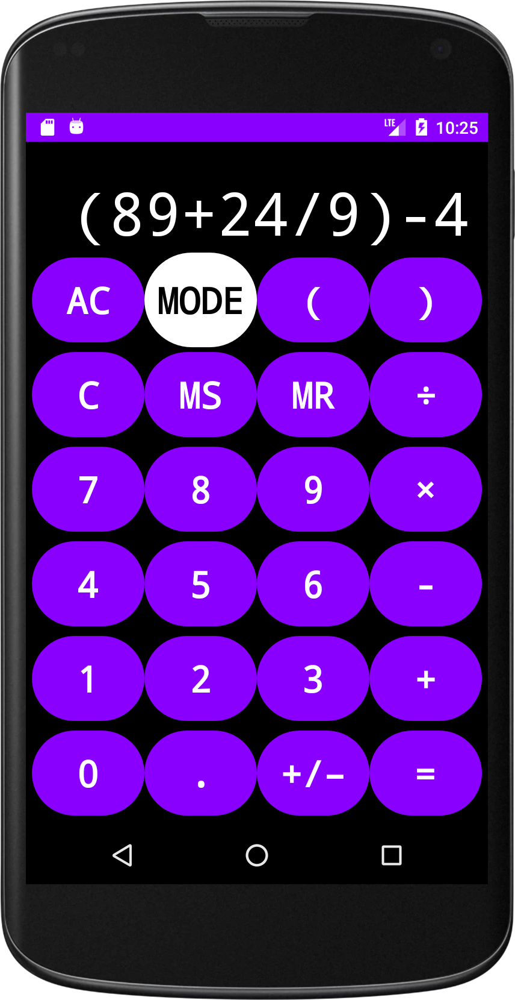

# Android Calculator
This project allowed me to explore programming in the Android environment. It was an assignment in my Mobile Computing class at Brock University, where we had to create a calculator app using Android Studio.

The calculator has 2 modes:
* Simple Mode
	* Perform simple calculations one after another. Similar to the Apple calculator found on their mobile devices.
* Formula Mode
	* Enter an entire expression at once, with potential parentheses, and have it evaluated.

To evaluate formulas, the app converts the entered infix expression into postfix. The implementation of the infix to postfix algorithm was done by me, in [Calculator.java](https://github.com/Gexff/androidcalculator/blob/main/app/src/main/java/ca/brocku/cosc3p97_a1/Calculator.java), and I used a pseudocode reference I found online as a guide.

# Screenshots
* Simple Mode

* Formula Mode
