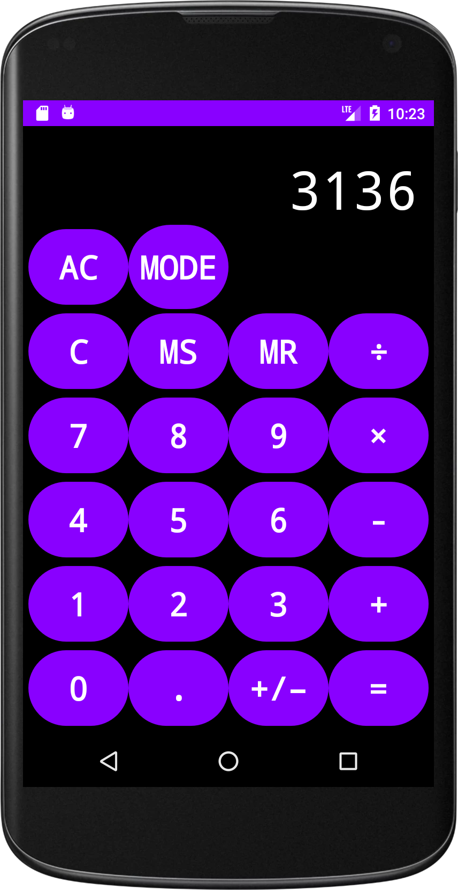

# Android Calculator
This project allowed me to explore programming in the Android environment. It was an assignment in my Mobile Computing class at Brock University, where we had to create a calculator app using Android Studio.

The calculator has 2 modes:
* Basic Mode
	* Perform simple calculations one after another. Similar to the Apple calculator found on their mobile devices.
* Formula Mode
	* Enter an entire expression at once, with potential parentheses, and have it evaluated.

To evaluate formulas, the app converts the entered infix expression into postfix. The implementation of the infix to postfix algorithm was done by me, in [Calculator.java](https://github.com/Gexff/android-calculator/blob/main/app/src/main/java/ca/brocku/cosc3p97_a1/Calculator.java), and I used a pseudocode reference I found online as a guide.

# Buttons
| Button(s) | Function                                                                                                                                                                                                    |
|-----------|-------------------------------------------------------------------------------------------------------------------------------------------------------------------------------------------------------------|
| 0-9       | Appends the current operand with the selected digit.                                                                                                                                                        |
| .         | Appends a decimal. If in basic mode and a decimal already exists, moves the decimal to the far right of the operand.                                                                                        |
| ( )       | Appends the bracket to the expression, only available in formula mode.                                                                                                                                      |
| +/–       | In basic mode, toggles the current operand between positive and negative In formula mode, appends the (–) sign.                                                                                             |
| ÷ × + -   | In basic mode, selects the operator to be used. If an operator is already selected and another is pressed, performs the previous calculation.                                                               |
| =         | Performs the operation.                                                                                                                                                                                     |
| AC        | All-clear. Press when “Error” is displayed to reset.                                                                                                                                                        |
| C         | Clear. If an operator is selected in basic mode, it will unselect it. If an operand was last pressed, it will remove the digit on the far right. In formula mode, removes the digit on the right hand side. |
| MODE      | Toggle button to switch between basic and formula modes.                                                                                                                                                    |
| MS        | Save the current displayed value to memory.                                                                                                                                                                 |
| MR        | In basic mode, sets the current operand to the saved value. In formula mode, appends the saved value to the expression.                                                                                     |

# Screenshots
* Basic Mode

* Formula Mode
